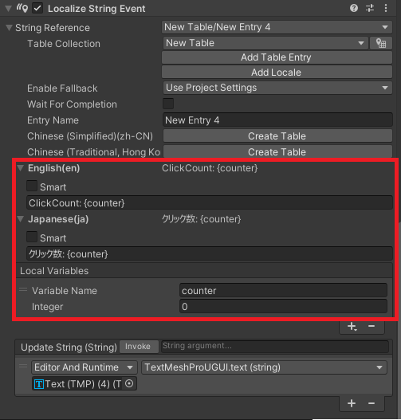
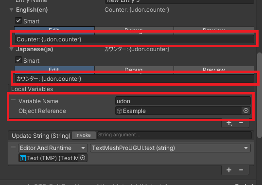
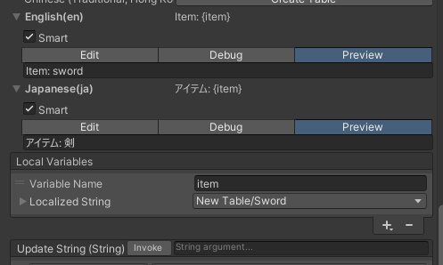

# Udon で変数を動的に書き換える

ローカライズテキストに埋め込んでいる変数を動的に書き換えることができます。  
Udon からローカル変数の値を書き換えることができます。  

### Udon からローカル変数の値を書き換える

ローカライズテキストは以下のように設定されているとします。  


以下のような Udon が存在するとします。  
この Udon は `OnClick` メソッドが呼び出されると `counter` 変数をインクリメントしローカル変数に反映してからテキストを更新します。  
変数の値をセットすると同時にローカライズの更新処理も呼び出されます。

```csharp
public class ClickCounter : UdonSharpBehaviour {
    [SerializeField]
    LocalizeStringEvent localizeStringEvent;

    int counter = 0;

    private void Update() {
        if (Input.GetKeyDown(KeyCode.Alpha3)) {
            counter++;
            var localizedString = localizeStringEvent.GetLocalized();
            if (localizedString.TryGetValue<IntVariable>("counter", out var _value)) {
                _value.SetValue(counter);
            }
        }
    }
}
```

インスペクタから対象とする LocalizeString コンポーネントを指定しておきます。  
以上で `3キー` を押すとカウントが1つずつ上がって表示されます。

### Udon の変数をローカル変数として埋め込む

以下のように `Object Reference` 型を利用することで Udon 内の変数を直接埋め込むことができます。  


Udon は以下のように定義しておきます。  

```csharp
public class ClickCounter : UdonSharpBehaviour {
    [SerializeField]
    LocalizeStringEvent localizeStringEvent;

    public int counter = 0;

    private void Update() {
        if (Input.GetKeyDown(KeyCode.Alpha4)) {
            counter++;
            localizeStringEvent.RefreshString();
        }
    }
}
```

変数を更新した際にはローカライズの更新処理を呼び出す必要があります。

<!-- ### ローカライズテキスト変数の値を書き換える

ローカライズテキストは以下のように設定されているとします。  


ローカル変数で "Localized String" 型を使用した場合は以下のような処理が必要です。  
Udon は `Lottery` メソッドが呼び出されると値を書き換えることとします。

```csharp
public class ItemChanger : UdonSharpBehaviour {
    [Inject, SerializeField, HideInInspector]
    ILocalization localization;
    [SerializeField]
    GroupId<LocalizeStringEvent> groupId;
    [SerializeField]
    VariableId<LocalizeStringEvent> variableId;
    [AssetId, SerializeField]
    string[] assetIds;

    public void Lottery() {
        localization.SetVariable(variableId, assetIds[Random.Range(0, assetIds.Length)]);
        localization.RefreshString(groupId);
    }
}
```

以上で `Lottery` メソッドが呼び出されるたびに "item" 変数にセットされているローカライズテキストが変更されてテキストも更新されます。 -->
