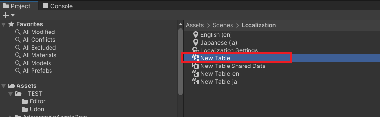
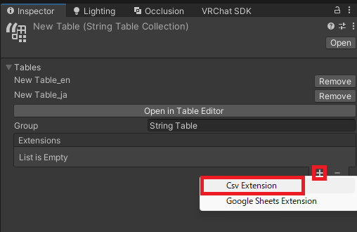
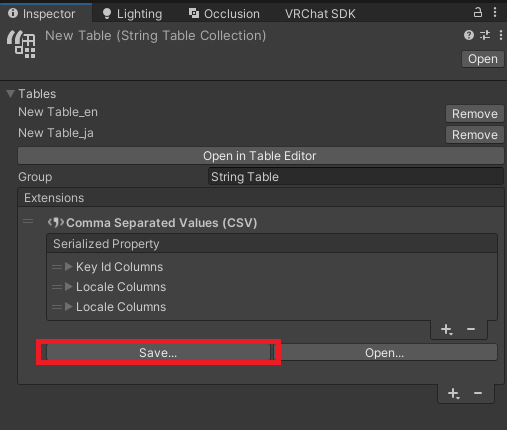
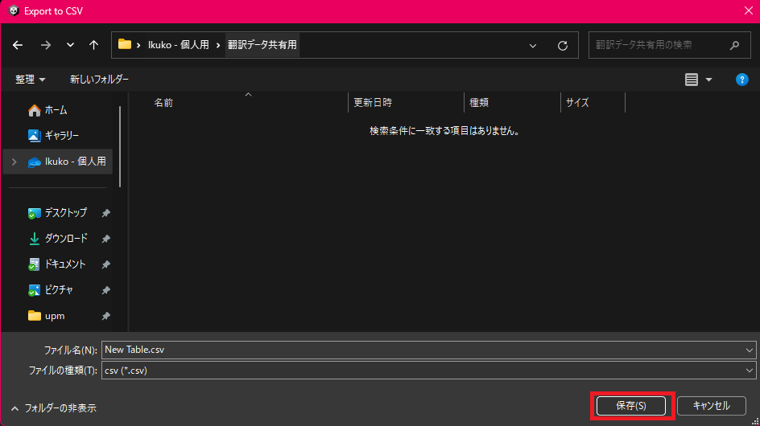
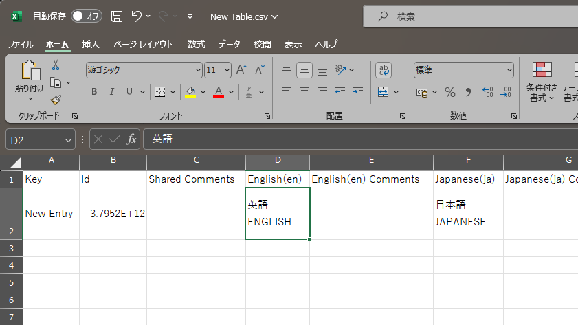
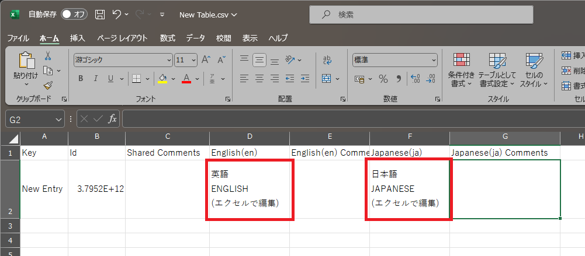
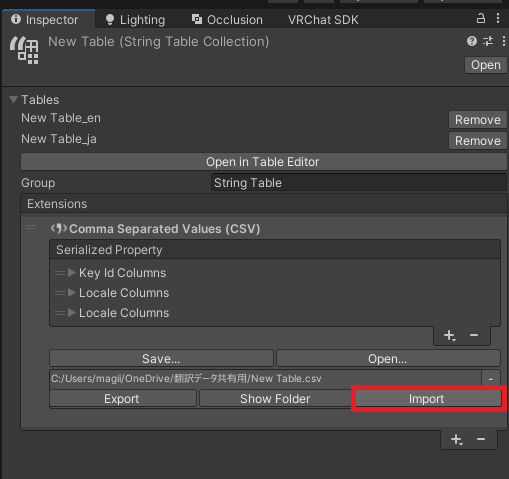
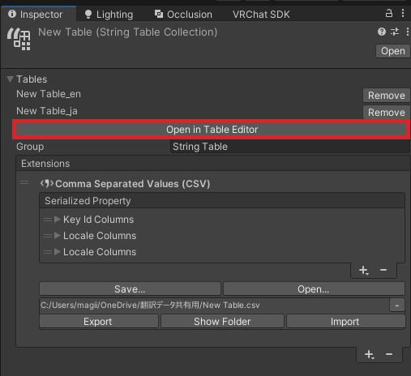
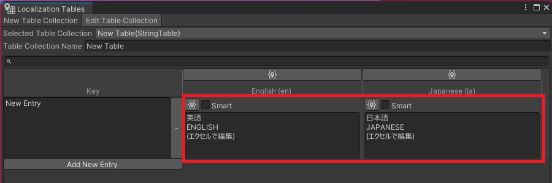

# CSV で連携

CSV ファイルと連携することで複数人で連携して翻訳作業を行うことが可能になります。  
保存場所を工夫することでより手軽に共有を行うこともできます。

### CSV にエクスポートする

以前保存しておいた翻訳テーブルを選択します。  

インスペクタから "+" を選び表示されるメニューから "Csv Extension" を選択します。

表示が変わるので "Save" を選びます。  

保存先を聞かれるので適当な場所を選択して保存します。  
この時 OneDrive など、共有可能な場所を選ぶことで他の人と翻訳データを共有して作業することができるようになります。

保存された CSV ファイルをエクセルで開くと設定済みの翻訳データが表示されます。

### CSV をインポートする

エクセルで CSV を編集して書き出します。  

翻訳テーブルを選択した状態で、インスペクタから "Import" を選びます。  

以上で取り込みが完了しました。  
インスペクタ上から "Open in Table Editor" を押してみましょう。  

以下のような編集画面が開きます。  
エクセルで編集した内容が反映されていれば完了です。  

