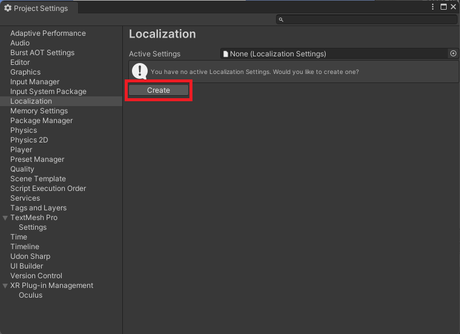
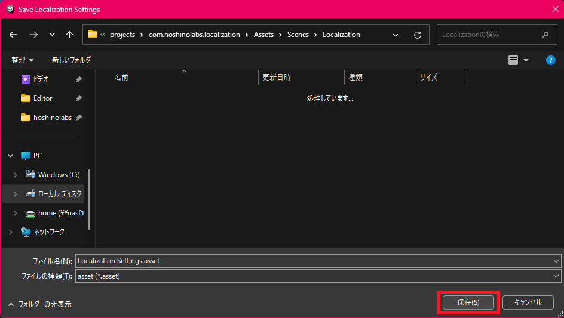
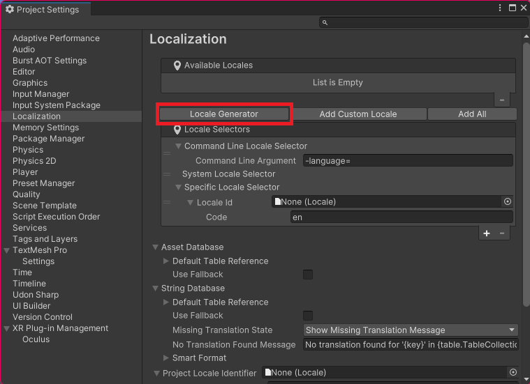
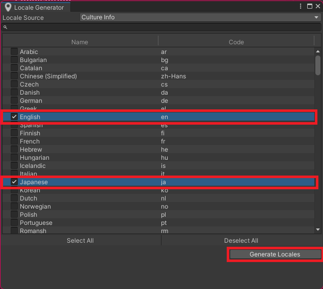
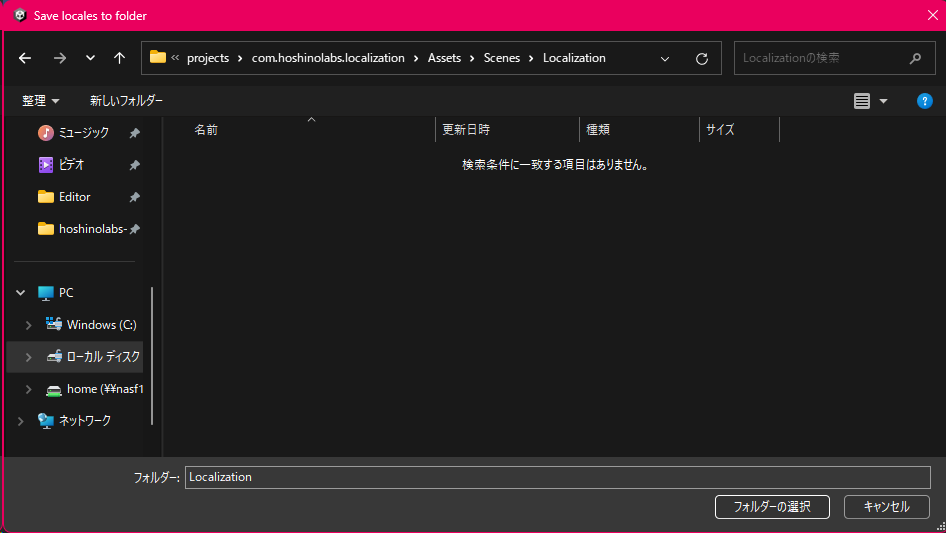
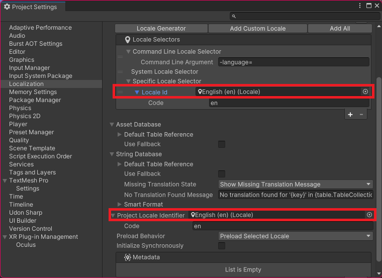

# 初期設定

初めに初期設定を行う必要があります。  
この設定はプロジェクトで共有されるため複数のワールドを1つのプロジェクトで管理している場合は注意が必要です。  

### ローカライズ設定を作成

上部のメニューバーから "Project Settings" を選び設定ウィンドウを呼び出します。  
次に左のメニューから "Localization" を選び、表示された画面から "Create" のボタンを押します。  

保存先を確認されるので適当なフォルダを選択し "保存" を押します。  

### ローカライズ言語を追加

次にローカライズ言語を設定する必要があります。  
画面上の "Locale Generator" を押しましょう  

表示されたウィンドウから追加したい言語を選択して、最後に "Generate Locales" を押します。  
今回は "英語" と "日本語" を選択しました。  

ここでは好きな言語を追加することができますが VRChat の言語設定と一致させたい場合は VRChat が対応しているものを選択する必要があります。  
VRChat が対応している言語は文章化されていませんので以下の表を参照して下さい。  

| Name | Code |
| ---- | ---- |
| English | en |
| French | fr |
| Spanish | es |
| Italian | it |
| Korean | ko |
| German | de |
| Japanese | ja |
| Polish | pl |
| Russian | ru |
| Portuguese (Brazil) | pt-BR |
| Chinese (Simplified) | zh-CN |
| Chinese (Traditional, Hong Kong SAR China) | zh-HK |
| Toki Pona | tok |

最後に保存先を聞かれるので適当なフォルダを選択し "保存" を押します。  

### 初期言語の設定

以下の2か所で右側の "◎" を選ぶと先ほど作成した言語を選択できるので、デフォルトにしたい言語を選択しましょう。  

