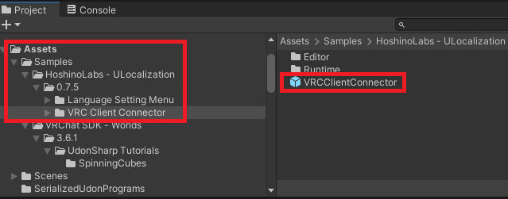
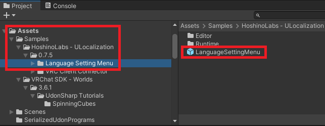

# Initialization World

アセット導入時点で本アセットの導入は完了しています。  
ここでは言語設定の切り替えを連携させるためのメニューなどの設置方法を説明します。  
Udon などを用いてより複雑な制御を行いたい場合は Tutorial-Extras の項目を参照してください。

### ユーザーの言語設定に合わせて自動で言語を切り替える

以下のプレハブをワールドに設置します。  

ワールドをビルドして確認してみましょう。  
メニューから言語を切り替えてみるとワールドに設置していたテキストも連動して切り替わるようになりました。  

### 言語切り替えメニューをワールドに設置する

以下のプレハブをワールドに設置します。  

ワールドをビルドして確認してみましょう。  
ドロップダウンから言語を選択するとテキストが連動して切り替わりました。  

