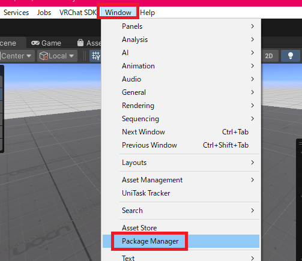
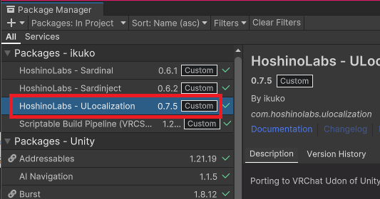
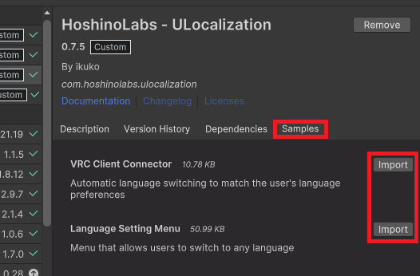

# ワールドの連携設定

アセット導入時点で本アセットの導入は完了しています。  
そのままでは言語を切り替えることができませんのでワールドに合わせて連携用の仕組みを導入する必要があります。  
サンプルとして簡易的に動作するプレハブを用意しています。  
Udon などを用いてより複雑な動作をさせることも可能です。

### プレハブのインポート

最初に必要なプレハブを以下の手順でインポートしてください。

上部メニューバーの "Window" から "Package Manager" を選びます。

開いたウィンドウ内の "HoshinoLabs - ULocalization" を選びます。

右側の "Samples" を選択し下部の "Import" ボタンを押してください。

### ユーザーの言語設定に合わせて自動で言語を切り替える

設定から変更できる言語設定に自動で連動させる方法です。

以下のプレハブをワールドに設置します。  

ワールドをビルドして確認してみましょう。  
メニューから言語を切り替えてみるとワールドに設置していたテキストも連動して切り替わるようになりました。  

### 言語切り替えメニューをワールドに設置する

ワールド内のメニューから言語を選択して変更する方法です。

以下のプレハブをワールドに設置します。  

ワールドをビルドして確認してみましょう。  
ドロップダウンから言語を選択するとテキストが連動して切り替わりました。  

