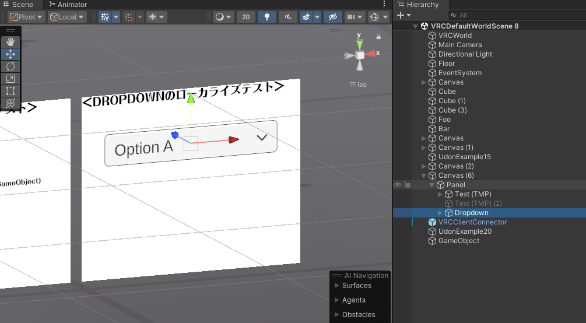
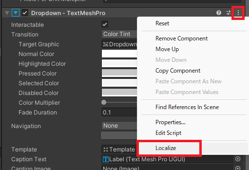
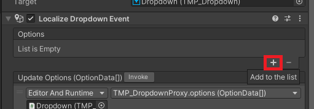
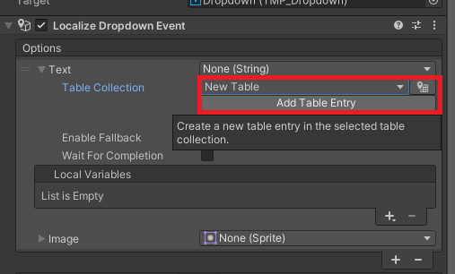
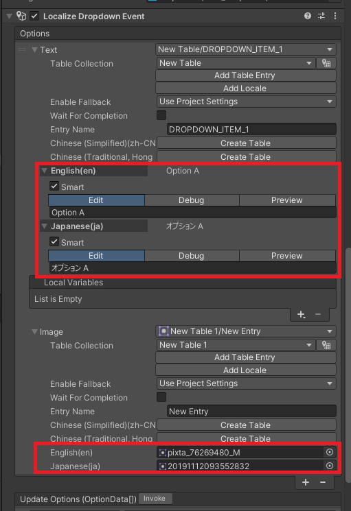

# ドロップダウンのローカライズ

ドロップダウンのローカライズもとても簡単に行えます。  
以下のようなドロップダウンがワールドに存在するとします。  

### ローカライズ設定を追加

インスペクタからローカライズしたいドロップダウンの右側にある "…" を選びます。  
表示されたメニューの "Localize" を選びましょう。  

### オプションの追加

通常のドロップダウンと同じように "＋" を押して項目を増やします。  

### オプションごとのデータを設定

`Text` と `Image` の項目を展開して翻訳テーブルと値をセットしましょう。  

以下のようにそれぞれの値を設定すれば通常のドロップダウンのように機能します。  

### 設定完了

これでローカライズの設定は完了です。  
再生して言語を切り替えると言語に合わせて設定した内容に切り替わることを確認できます。  
<!--  -->

