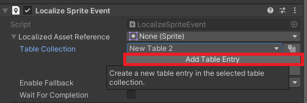
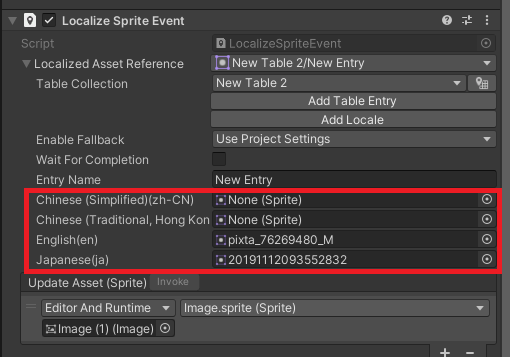

# Localize Image

画像のローカライズもとても簡単に行えます。  
以下のようなスプライトがワールドに存在するとします。  
<!--  -->

### ローカライズ設定を追加

インスペクタからローカライズしたいスプライトの右側にある "…" を選びます。  
表示されたメニューの "Localize" を選びましょう。  
<!--  -->

### 翻訳テーブルを追加

**これは初回だけ行えば問題ありません。**  
**テーブルを分けたい場合は追加で行いましょう。**

インスペクタに `Localize Sprite Event` という項目が増えているはずです。  
その中にある "Create Table Collection" を押しましょう。  
<!--    -->

表示されたウィンドウの `Name` にテーブルに付けたい名前を入力します。  
最後に "Create" を押すと保存先を聞かれるので保存先を選択して保存します。  
<!--  -->

表示されたウィンドウは一旦気にせず "×" を押して閉じます。

### 言語ごとの画像を設定

ローカライズしたいスプライトの `Table Collection` の欄を開いて先ほど作成したテーブルを選択します。  
<!--  -->

次に "Add Table Entry" を押します。  
<!--  -->

これでローカライズ設定が完了しました。  
言語の部分をに言語に合わせたスプライトをセットする欄が現れるので各言語に対応したスプライトをセットしましょう。  
<!--  -->

### 設定完了

これでローカライズの設定は完了です。  
再生して言語を切り替えると言語に合わせて設定したスプライトに切り替わることを確認できます。  
<!--  -->

