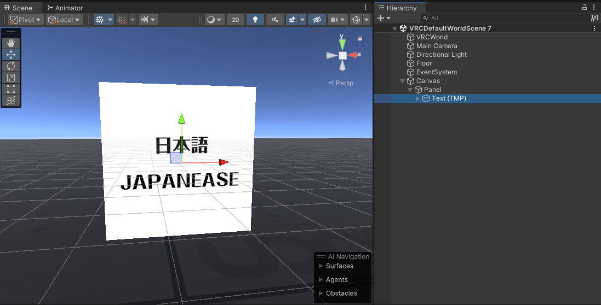
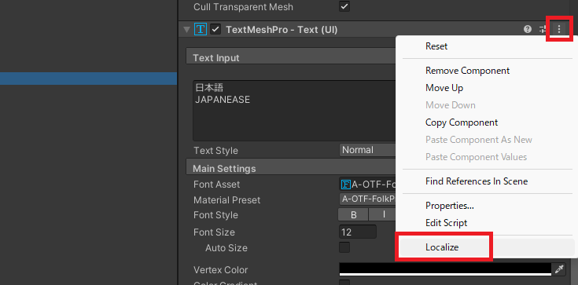
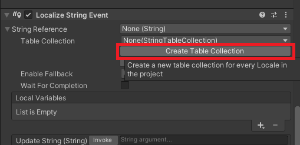
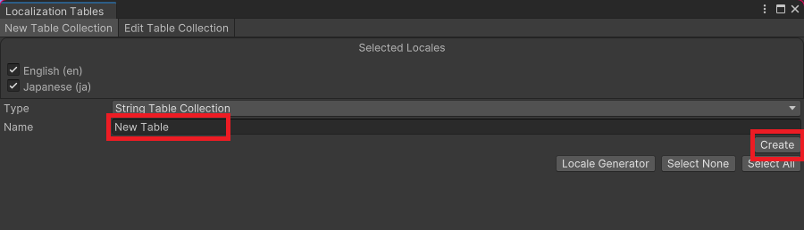
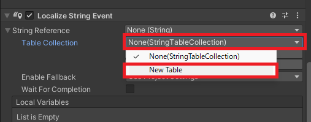
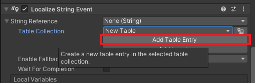
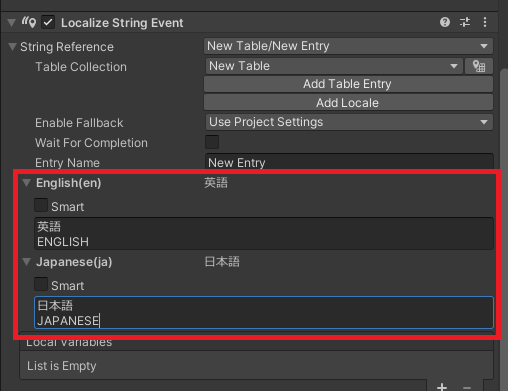

# 文字列のローカライズ

初期設定が終わっていればテキストのローカライズはとても簡単です。  
以下のようなテキストがワールドに存在するとします。  

### ローカライズ設定を追加

インスペクタからローカライズしたいテキストの右側にある "…" を選びます。  
表示されたメニューの "Localize" を選びましょう。  

### 翻訳テーブルを追加

**これは初回だけ行えば問題ありません。**  
**テーブルを分けたい場合は追加で行いましょう。**

インスペクタに `Localize String Event` という項目が増えているはずです。  
その中にある "Create Table Collection" を押しましょう。  
  

表示されたウィンドウの `Name` にテーブルに付けたい名前を入力します。  
最後に "Create" を押すと保存先を聞かれるので保存先を選択して保存します。  

表示されたウィンドウは一旦気にせず "×" を押して閉じます。

### 翻訳文を追加

ローカライズしたいテキストの `Table Collection` の欄を開いて先ほど作成したテーブルを選択します。  

次に "Add Table Entry" を押します。  

これでローカライズ設定が完了しました。  
言語の部分を選択すると入力欄が展開するので各言語に対応した文章を入力しましょう。  

### 設定完了

これでローカライズの設定は完了です。  
再生して言語を切り替えると言語に合わせて設定したテキストに切り替わることを確認できます。  

