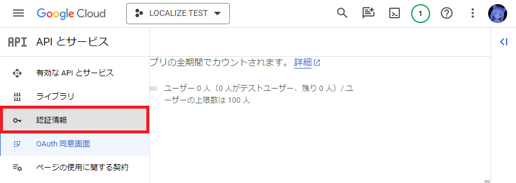
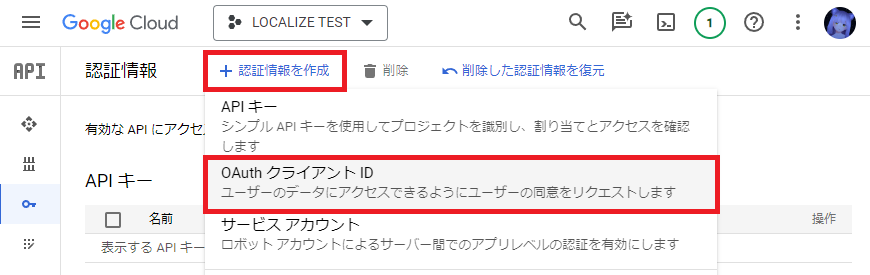
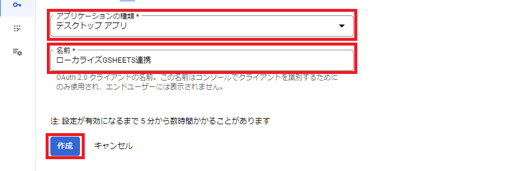
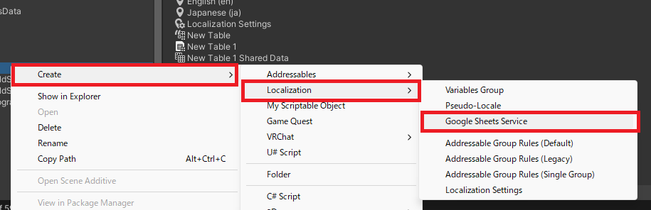
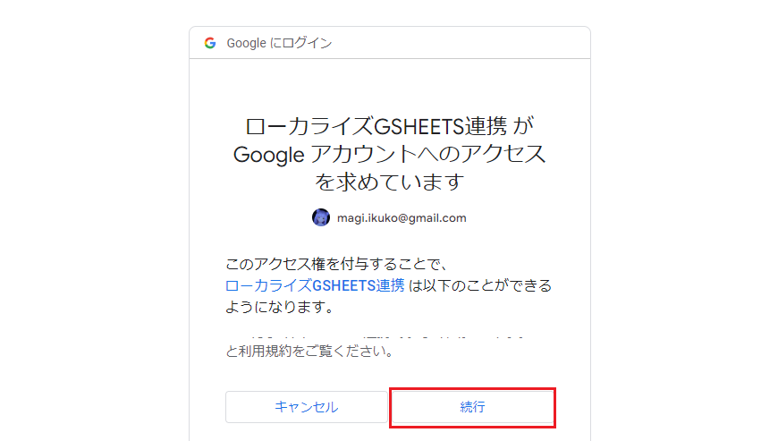
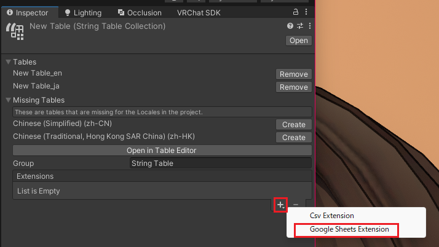
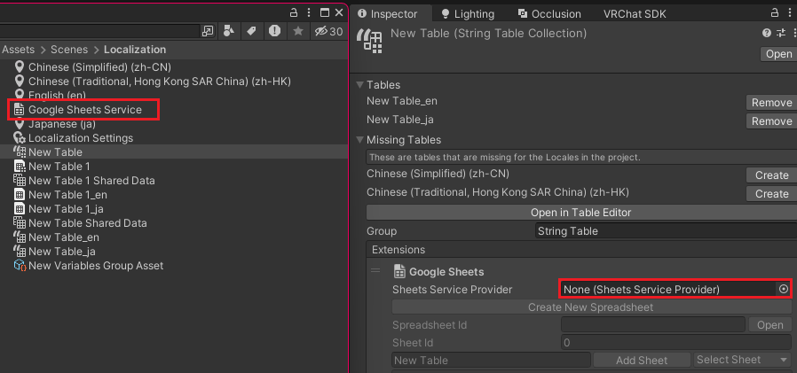
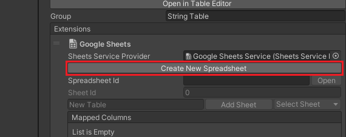

# Link Google Sheets

Google Sheets と連携することも可能です。  
CSV と比べて更にシームレスに連携することが可能になります。  
また Google Sheets では複数人同時編集も可能になります。

**Google Sheets と連携するには Google の開発者登録が必要です。**  
**複雑な設定が必要で設定を間違えると課金が発生する場合があります。**  
**苦手な人は CSV 連携をご利用ください。**

### Google に認証情報を登録する

最初に以下のページにアクセスします。  
まだアカウントが未登録の人はアカウント登録を済ませてダッシュボードが見れるようにしましょう。  
[🔗Google Cloud Console Dashboard](https://console.cloud.google.com/home/dashboard)

登録が完了したらダッシュボードにログインできるようになっています。  
プロジェクトを作成するため左上の "プロジェクトを選択" を押します。  
次に開いたウィンドウから "新しいプロジェクト" を押します。  

次にプロジェクト名を入力して "作成" を押しましょう。  

プロジェクトの作成には数分掛かります。  
作成が完了したら上部メニューからプロジェクトが選択可能になります。  

左上のハンバーガーメニューを押します。  
開いたメニューから "APIとサービス" を選び "OAuth 同意画面" を選択します。  

ユーザータイプを選択して "作成" を押します。  
どちらを選んでも問題ありませんがここでは `外部` を選択します。  

適当なアプリ名を入力して画面下部の "保存して次へ" を押します。  
必須項目は適当な値で埋めます。  
何度か次へ進めると OAuth 連携用の設定が作成されます。  

テストユーザーの欄に自分のアカウントを登録しておきましょう。  

次に左のメニューから "認証情報" を選びます。  

画面が切り替わるので上のメニューから "認証情報を作成" を選び "OAuth クライアント ID" を選択します。  

作成画面が表示されるのでアプリケーションの種類を `デスクトップアプリ` にして適当な名前を付け作成を押します。  

作成が完了すると画面上にクライアントIDとクライアントシークレットが表示されるので記録しましょう。  
この値はローカルに保存し誰にも公開しないようにします。  
JSON 形式でダウンロードすることもできます。  

左のメニューから "有効な API とサービス" を選びます。  

検索欄に `google sheets api` と入力して検索します。  

見つかった "Google Sheets API" を選択します。  

表示された画面上で有効にします。  

### 認証情報の設定

最初に Project ウィンドウから適当な場所で右クリックをします。  
表示されたメニューから "Create" を選び "Localization" の次に "Google Sheets Service" の順に選択します。  

ファイルが作成されるのでクリックして選択します。  

インスペクタに表示されるので以下のように変更します。  
"Client Id" と "Client Secret" は先ほど取得した認証情報を入力します。  
"Load Credentials..." のボタンを押すとダウンロードした JSON ファイルを読み込むこともできます。  
最後に "Authorize" ボタンを押します。  

Google のログイン画面が表示されるので登録済みのアカウントでログインします。  

警告画面が表示されたら内容をよく読み "続行" を押します。  

同意画面が表示されるので内容をよく読み "続行" を押します。  
エラーの表示が出なければ成功です。  

### 翻訳テーブルを Google Sheets と連携する

テーブルを Project ウィンドウから選択します。  

インスペクタにテーブルコレクションが表示されます。  
下部の "Extensions" の "+" を押し表示されたメニューから "Google Sheets Extension" を選びます。  

先ほど作成した "Google Sheets Service" をインスペクタの "Sheets Service Provider" に設定します。  

次に "Create New Spreadsheet" を押します。  
これで新しいスプレッドシートが作成されます。  
既存のシートがある場合はシートIDを入力してもよいですが念のためバックアップとして残し新しく作るほうが良いでしょう。  

下部の "+" を押し表示されたメニューから "Add Default Columns" を選びます。  

これでスプレッドシートと連携するカラムが設定できました。  
最後にスプレッドシートへデータを反映するため "Push" を押しましょう。  

GSheets を確認すると反映されているのを確認できます。  

GSheets から取り込みたいときは "Pull" を押します。  

