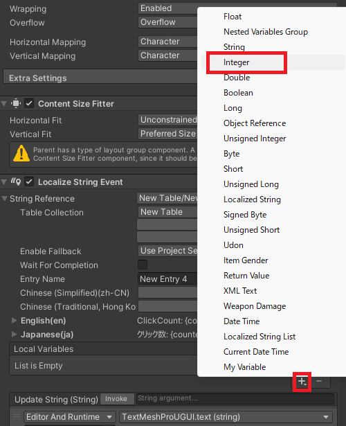
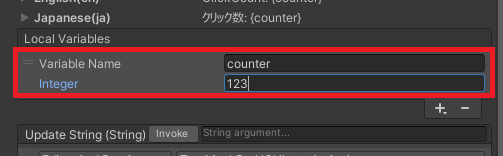
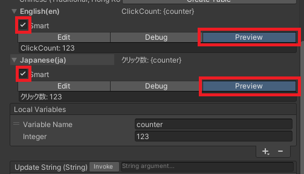
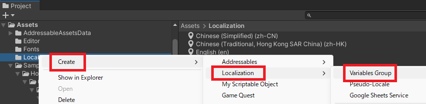
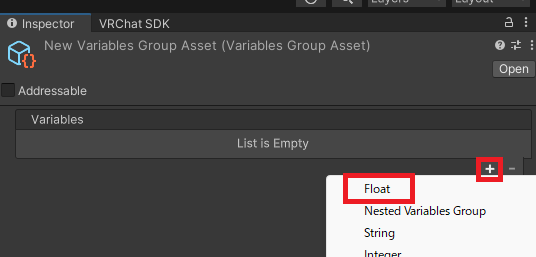
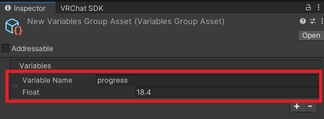
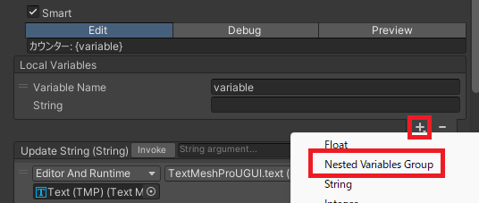
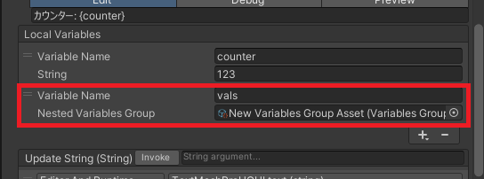
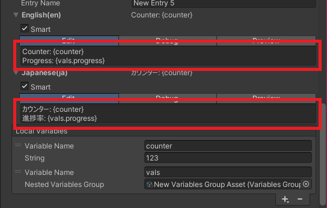

# 文字列への変数埋め込み

ローカライズテキストはローカル変数を文字列に埋め込むことができます。  

### ローカル変数の利用

特定のローカライズで局所的に変数を利用する場合はこちらを利用します。  

ローカル変数はローカライズテキストの "Local Variables" から追加できます。  
まず "+" を選び表示されるメニューから使用したい型を選択します。  
例では `Integer` を選び整数を扱えるようにします。  

項目が追加されるので名前と初期値を設定します。  

ローカル変数の埋め込みを行うにはテキストの "Smart" のチェックをオンにします。  
"Preview" を選択することで実際に埋め込んだ時の表示を確認することができます。  

## グローバル変数の利用

複数の文字列で変数を共有したい場合はこちらを利用します。  

アセットウィンドウを右クリックし "Create" を選択します。  
表示されたメニューの "Create" を選び "Localization" の中の "Variable Group" を選びます。  

アセットが作成されるのでインスペクタから変数を追加します。  
追加は "+" を選び表示されるメニューから使用したい型を選びます。  
例では `Float` を選び変数を追加します。  

変数が追加されたら名前と初期値を設定します。  

グローバル変数を利用したいローカライズでローカル変数と同じように設定を行います。  
文字列の場合は "Smart" のチェックをオンにします。  
ローカル変数で `Nested Variables Group` を追加します。  

先ほど作成した Variable Group をセットし名前を付けます。  

文字列に変数を埋め込みます。  

