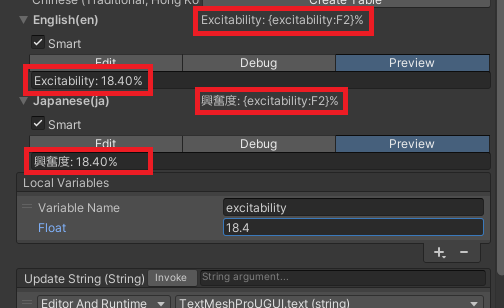
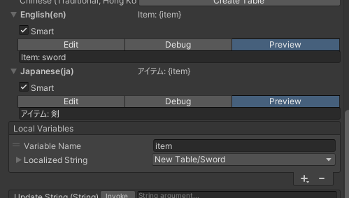
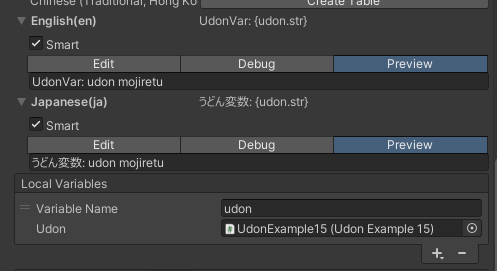

# Smart String

ローカライズテキストは様々なローカル変数を埋め込むことができます。

### プリミティブ型の埋め込み

基本的な型であるプリミティブ型が扱えます。  

### 埋め込み時の数値書式設定

埋め込み変数の後ろに書式設定文字列を付与することで埋め込み時に書式設定を行うことができます。  
例では変数の少数二桁まで表示するように設定しています。  

書式設定文字列については次のページを参照して下さい。  
[🔗標準の数値書式指定文字列](https://learn.microsoft.com/ja-jp/dotnet/standard/base-types/standard-numeric-format-strings)

### ローカライズテキストの埋め込み

他のローカライズテキストを埋め込むこともできます。  

### Udon 変数の埋め込み

外部の Udon 変数を直接埋め込むこともできます。  
例ではセットされた Udon の "str" という変数の中身を埋め込んでいます。  

