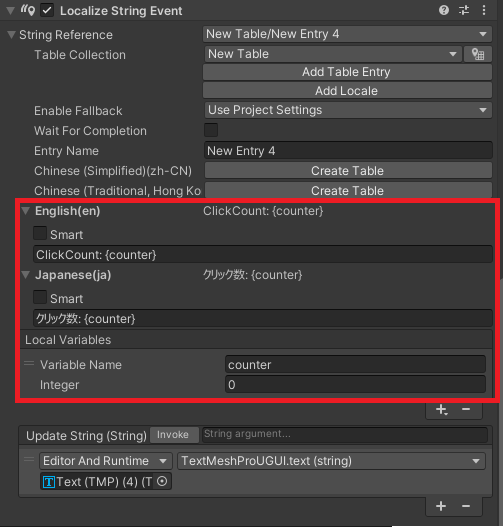

# Udon Variables

ローカライズテキストに埋め込んでいる変数を動的に書き換えることができます。  
Udon からローカル変数の値を書き換えることができます。  

### Udon からローカル変数の値を書き換える

ローカライズテキストは以下のように設定されているとします。  


以下のような Udon が存在するとします。  
この Udon は `OnClick` メソッドが呼び出されると `counter` 変数をインクリメントしローカル変数に反映してからテキストを更新します。

```csharp
public class ClickCounter : UdonSharpBehaviour {
    [Inject, SerializeField, HideInInspector]
    ILocalization localization;
    [GroupId, SerializeField]
    string groupId;
    [VariableId, SerializeField]
    string variableId;

    int counter = 0;

    public void OnClick() {
        localization.SetVariable(variableId, ++counter);
        localization.RefreshString(groupId);
    }
}
```

インスペクタから対象とする LocalizeString コンポーネントを指定しておきます。  
併せて対象のローカル変数も指定しておきます。  
以上で `ClickCounter.OnClick` が呼び出されるとカウントが1つずつ上がって表示されます。

<!-- ### ローカライズテキスト変数の値を書き換える

ローカライズテキストは以下のように設定されているとします。  


ローカル変数で "Localized String" 型を使用した場合は以下のような処理が必要です。  
Udon は `Lottery` メソッドが呼び出されると値を書き換えることとします。

```csharp
public class ItemChanger : UdonSharpBehaviour {
    [Inject, SerializeField, HideInInspector]
    ILocalization localization;
    [GroupId, SerializeField]
    string groupId;
    [VariableId, SerializeField]
    string variableId;
    [AssetId, SerializeField]
    string[] assetIds;

    public void Lottery() {
        localization.SetVariable(variableId, assetIds[Random.Range(0, assetIds.Length)]);
        localization.RefreshString(groupId);
    }
}
```

以上で `Lottery` メソッドが呼び出されるたびに "item" 変数にセットされているローカライズテキストが変更されてテキストも更新されます。 -->
